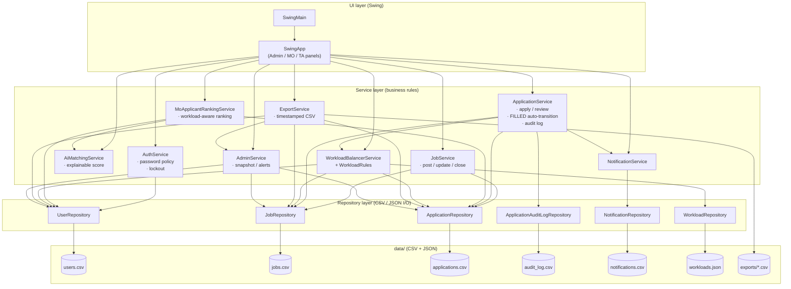
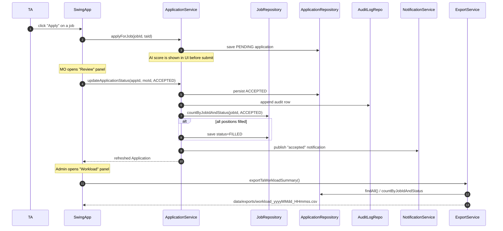

# TA Recruitment System — Group 52

[](https://github.com/SMZ9795/TA-Recruitment-System-Group52/actions/workflows/build-and-test.yml)


> Software Engineering Group Project — BUPT International School / QMUL
> joint programme. A desktop Teaching-Assistant recruitment platform with
> three roles (Admin / Module Organiser / Teaching Assistant), explainable
> AI matching, workload balancing, audit log, and CSV exports.

---

## Table of contents

1. [Quick start](#quick-start)
2. [Demo accounts](#demo-accounts)
3. [Feature highlights](#feature-highlights)
4. [Architecture](#architecture)
5. [Project layout](#project-layout)
6. [Data model](#data-model)
7. [Build and test](#build-and-test)
8. [Continuous integration](#continuous-integration)
9. [Iteration timeline](#iteration-timeline)
10. [Team and contributions](#team-and-contributions)

---

## Quick start

Requires JDK 17+. Clone the repo, then from the project root:

```bash
# macOS / Linux
./scripts/run.sh

# Windows PowerShell
./scripts/run.ps1
```

The script compiles `src/**/*.java` into `build/classes`, then launches
the Swing GUI (`com.group52.tarecruitment.SwingMain`). The first run
will create `data/exports/` for the CSV reports.

Prefer to do it by hand? See [Build and test](#build-and-test).

---

## Demo accounts

The seeded `data/users.csv` ships with the following accounts so the
demo always works out of the box:

| Role  | Email                       | Password    | Notes                          |
| ----- | --------------------------- | ----------- | ------------------------------ |
| Admin | `admin@bupt.local`          | `admin123`  | Full system view + exports     |
| MO    | `drsmith@bupt.local`        | `mo123456`  | Has open jobs in CS modules    |
| MO    | `profli@bupt.local`         | `mo234567`  | Has open jobs in DS modules    |
| TA    | `alice.zhang@bupt.local`    | `ta123456`  | CS / Java + SQL skills, 12 h   |
| TA    | `bob.liu@bupt.local`        | `ta234567`  | DS / Python + ML skills, 10 h  |
| TA    | `carol.wu@bupt.local`       | `ta345678`  | Applied Maths, 8 h             |

Passwords created via the in-app Register / Change Password flows are
checked against the iteration-4 password policy (8+ chars, upper / lower
/ digit / special). The legacy seeded passwords above are kept short on
purpose for demo speed; they will trigger a "weak password" warning if
you try to set one via the UI.

---

## Feature highlights

- **Three-role workflow.** Admin manages users + sees system-wide
  workload, Module Organiser posts jobs + reviews applicants,
  Teaching Assistant searches jobs + applies + tracks status.
- **Explainable AI matching.** `AiMatchingService` returns a 0–100
  fit score plus *matched skills*, *missing skills*, *hours-fit
  detail* and an *action hint*. Every decision is traceable; nothing
  is a black box.
- **Workload-aware ranking.** `MoApplicantRankingService` joins the
  applicant pool with `getAcceptedWorkloadHoursForTa(...)` so the MO
  side ranking demotes overloaded TAs even when their skill match is
  perfect. Centralised rules in `WorkloadRules` (BALANCED / UNDERUSED /
  OVERLOADED, transferable hours, missing hours).
- **Audit log.** Every status change is appended to
  `ApplicationAuditLogRepository` with operator, previous status, new
  status and timestamp. Queryable by TA or by Job for accountability.
- **CSV exports.** Admin can export *all applications*, *TA workload
  summary*, *job filling status*; MO can export *applicants for a
  specific job*. Files are written to `data/exports/` with a
  timestamped filename (`<report>_<yyyyMMdd_HHmmss>[_n].csv`) so
  repeated exports inside the same second never collide.
- **Self-healing job state.** When an MO accepts the last position
  the job is auto-marked `FILLED`; the same logic flips it back to
  `OPEN` if the TA later withdraws.
- **Account security.** Password strength enforced at registration
  and change; account locks after 5 failed logins and auto-unlocks
  after the lock window expires.
- **42-test automated regression suite.** Plain `java` runner — no
  Maven, no JUnit, no Gradle — so it stays trivially runnable from any
  classroom machine. See [Build and test](#build-and-test).

---

## Architecture

Classic layered architecture. The UI talks to a thin service layer,
which encapsulates business rules and delegates persistence to a
repository layer that reads / writes plain CSV (and one JSON) file.
No database, no Spring, no build tool — deliberately, so the code is
readable end-to-end in a classroom setting.



### Key end-to-end flow (apply → accept → workload → export)



---

## Project layout

```
TA-Recruitment-System-Group52/
├── .github/workflows/build-and-test.yml   # CI: javac + 42-test runner on every push/PR
├── scripts/                               # one-line build / run / test scripts
│   ├── build.ps1 / build.sh
│   ├── run.ps1   / run.sh
│   └── test.ps1  / test.sh
├── src/com/group52/tarecruitment/
│   ├── Main.java                          # CLI entry point (legacy)
│   ├── SwingMain.java                     # GUI entry point — wire-up
│   ├── model/        (11 files)           # POJOs: User, Job, Application, ...
│   ├── repository/   (6 files)            # CSV / JSON I/O per aggregate
│   ├── service/      (14 files)           # business rules — see Architecture
│   ├── ui/           (3 files)            # Swing panels: SwingApp + GuiApp + ...
│   └── util/         (8 files)            # CsvUtil, FileUtil, ValidationUtil,
│                                          # WorkloadRules, TaNotificationUtil,
│                                          # CvValidationUtil, JobFilterUtil
├── tests/com/group52/tarecruitment/tests/
│   └── RecruitmentSystemTestRunner.java   # 42 integration tests (no JUnit)
├── data/                                  # seeded sample data
│   ├── users.csv  jobs.csv  applications.csv  notifications.csv
│   ├── workloads.json
│   ├── avatars/   icons/
│   └── exports/                           # generated at runtime (gitignored)
└── tests/REGRESSION_CHECKLIST.md          # manual GUI regression checklist
```

---

## Data model

Plain Java POJOs serialised as CSV (or JSON for the small workload
table). Each repository owns one file and is the only writer to it,
which keeps schema evolution trivial.

| Entity              | File                          | Notes                                            |
| ------------------- | ----------------------------- | ------------------------------------------------ |
| `User`              | `users.csv`                   | Roles: `ADMIN` / `MO` / `TA`. CV + avatar paths. |
| `Job`               | `jobs.csv`                    | `OPEN` / `FILLED` / `CLOSED`.                    |
| `Application`       | `applications.csv`            | `APPLIED` / `REVIEWING` / `PENDING` / `ACCEPTED` / `REJECTED` / `WITHDRAWN`. |
| `ApplicationAuditLog` | `audit_log.csv`             | Append-only audit trail.                        |
| `Notification`      | `notifications.csv`           | Triggered by accept / reject / withdraw.         |
| `Workload`          | `workloads.json`              | TA → assigned job IDs (small JSON map).          |
| *Exports*           | `exports/*.csv`               | Timestamped reports generated on demand.         |

CSV reads are backwards compatible: legacy rows that pre-date the
`cvFilePath` / `avatarFilePath` columns still load with empty defaults
(`testLegacyUsersCsvCompatibility` proves this).

---

## Build and test

### Option A — scripts (recommended)

```bash
# macOS / Linux
./scripts/build.sh    # compile src + tests
./scripts/test.sh     # run 42 integration tests
./scripts/run.sh      # launch the Swing GUI
```

```powershell
# Windows PowerShell
./scripts/build.ps1
./scripts/test.ps1
./scripts/run.ps1
```

The Windows scripts force UTF-8 to avoid the classic `javac` Chinese-
path issue.

### Option B — by hand

```bash
mkdir -p build/classes build/test-classes

# Compile production sources
find src -name "*.java" -print0 \
  | xargs -0 javac -encoding UTF-8 -d build/classes

# Compile tests
find tests -name "*.java" -print0 \
  | xargs -0 javac -encoding UTF-8 \
      -cp build/classes \
      -d build/test-classes

# Run the 42-test integration suite
java -cp build/classes:build/test-classes \
  com.group52.tarecruitment.tests.RecruitmentSystemTestRunner

# Launch the Swing GUI
java -cp build/classes com.group52.tarecruitment.SwingMain
```

Expected test output ends with:

```
==== TEST SUMMARY ====
Passed: 42
Failed: 0
```

For manual GUI regression there is also
[`tests/REGRESSION_CHECKLIST.md`](tests/REGRESSION_CHECKLIST.md).

---

## Continuous integration

`.github/workflows/build-and-test.yml` runs on every push / PR to
`main`. It:

1. Sets up Temurin JDK 17.
2. Compiles `src/**/*.java` -> `build/classes`.
3. Compiles `tests/**/*.java` -> `build/test-classes`.
4. Runs `RecruitmentSystemTestRunner` and uploads the captured log.

If any step fails the merge is blocked. This protects `main` from the
"tests reference non-existent methods after a merge" class of bugs.

---

## Iteration timeline

| Iteration | Theme                              | Notable deliverables                                                                 |
| --------- | ---------------------------------- | ------------------------------------------------------------------------------------ |
| 1         | Core flow + CSV persistence        | Auth, Job CRUD, Apply / Withdraw, basic Swing UI.                                    |
| 2         | MO review + TA notifications       | Accept / Reject + audit log, in-app notifications, status summary.                   |
| 3         | Explainable AI + workload          | `AiMatchingService` + `WorkloadBalancerService` with `WorkloadRules` boundary logic. |
| 4         | Reports + security + final testing | CSV exports, password policy + lockout, change-password, 42-test runner, CI.         |

---

## Team and contributions

| Member          | QMUL ID    | Iteration-4 focus                                       |
| --------------- | ---------- | ------------------------------------------------------- |
| Mengzhe Shi     | 231226680  | MO applicant ranking + future-extension scaffolding.    |
| Hanyu Xiao      | 231226244  | TA profile + CV validation + notification utilities.    |
| Xiaowang        | 231226510  | Export CSV + reports, CI, repo hygiene.                 |
| Yucheng Liu     | 231226945  | Workload balancer + admin dashboards.                   |
| Zhixing Sun     | 231226738  | Password security + lockout + change-password UI.       |
| Conghao Li      | 231225546  | Final manual testing + regression checklist.            |

> The original credit lines from earlier iterations are preserved in
> `WORK_SUMMARY_CN.md` and `ITERATION4_COMPLETION_REPORT.md`.
